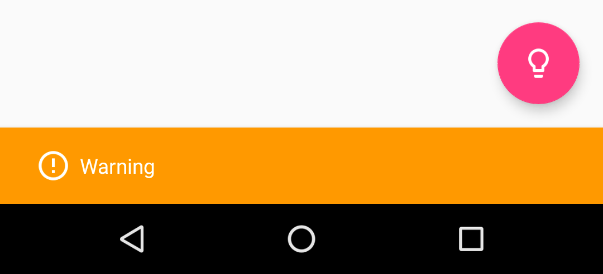
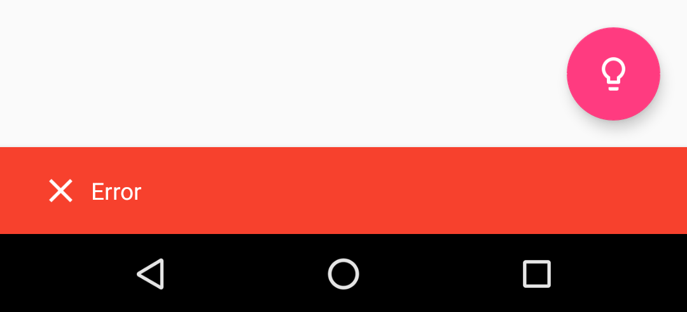
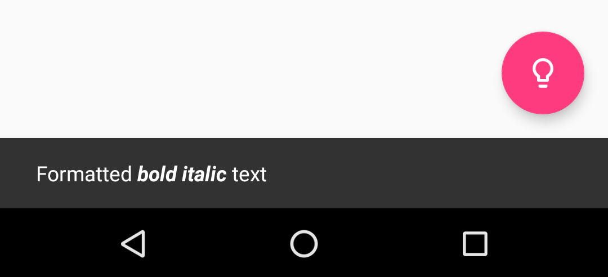
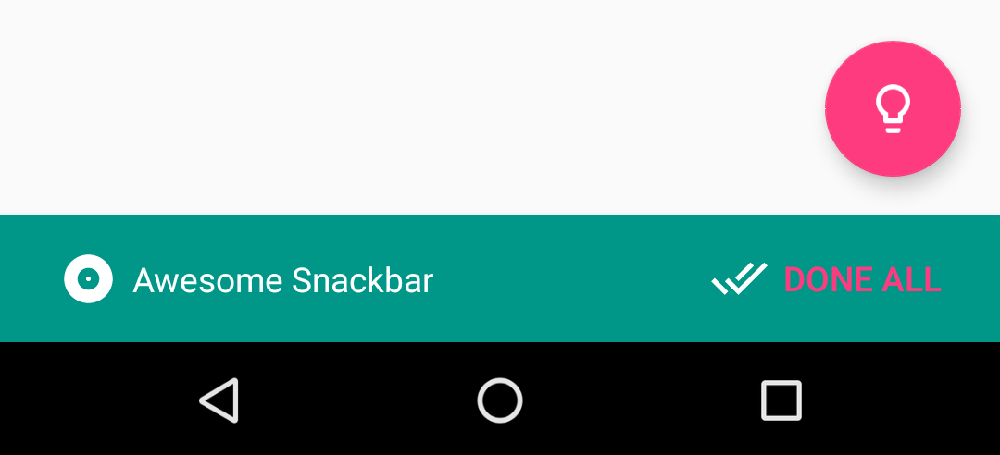

# Light
[](https://travis-ci.org/TonnyL/Light)
[  ](https://bintray.com/tonnyl/maven/light/_latestVersion)

<div align="center">
	
</div>

The usual Snackbar, but elegant. Inspired by [Toasty](https://github.com/GrenderG/Toasty).

## Screenshots

|     success     |      Info       |     warning     |
| :-------------: | :-------------: | :-------------: |
|   |        |  |

|      Error      |     Normal      |      Custom     |
| :-------------: | :-------------: | :-------------: |
|       |    |    |

## Download

### Gradle

Add the code below to your **root** `build.gradle` file (`NOT` your module `build.gradle` file, check [here](./build.gradle) for an example).

```groovy
allprojects {
    repositories {
        jcenter()
    }
}
```

Add the code below to your **module**'s `build.gradle` file:

```groovy
dependencies {
	// Other dependencies here.
	implemention 'io.github.tonnyl:light:1.1.0'
}
```

### Maven

```xml
<dependency>
  <groupId>io.github.tonnyl</groupId>
  <artifactId>light</artifactId>
  <version>1.1.0</version>
  <type>pom</type>
</dependency>
```

## Usage

Each method always returns a `Snackbar` object, so you can customize the Snackbar much more. **DO NOT FORGET TO CALL THE `show()` METHOD!**

+ To display a success Snackbar:

```Kotlin
// Kotlin
Light.success(fab, "Success", Snackbar.LENGTH_SHORT)
	.setAction("Action", {
		Toast.makeText(this@MainActivity, "Hello, Light!", Toast.LENGTH_SHORT).show()
	})
	.show()
```

```Java
// Java
Light.Companion.success(fab, "Success", Snackbar.LENGTH_SHORT)
	.setAction("Action", v ->
		Toast.makeText(SettingsActivity.this, "Hello, Light!", Toast.LENGTH_SHORT).show())
	.show());
```

+ To display an info Snackbar:

```Kotlin
// Kotlin
Light.info(fab, "Info", Snackbar.LENGTH_SHORT).show()
```

```Java
// Java
Light.Companion.info(fab, "Info", Snackbar.LENGTH_SHORT).show());
```

+ To display a warning Snackbar:

```Kotlin
// Kotlin
Light.warning(fab, "Warning", Snackbar.LENGTH_SHORT).show()
```

```Java
// Java
Light.Companion.warning(fab, "Warning", Snackbar.LENGTH_SHORT).show());
```

+ To display an error Snackbar:

```Kotlin
// Kotlin
Light.error(fab, "Error", Snackbar.LENGTH_SHORT).show()
```

```Java
// Java
Light.Companion.error(fab, "Error", Snackbar.LENGTH_SHORT).show());
```

+ To display the usual Snackbar:

```Kotlin
// Kotlin
Light.normal(fab, "Normal", Snackbar.LENGTH_SHORT).show()
```

```Java
Light.Companion.normal(fab, "Normal", Snackbar.LENGTH_SHORT).show();
```

+ You can also create your own Snackbar in custom-designed style:

```Kotlin
// Kotlin
Light.make(
	fab, // // The view to find a parent from.
	"Awesome Snackbar", // The message to show.
	Snackbar.LENGTH_INDEFINITE, // How long to display the message.
	R.drawable.ic_album_white_24dp, // The left icon of message to show.
	R.color.color_cyan, // The background color of Snackbar.
	android.R.color.white, // The color of text to show.
	R.drawable.ic_done_all_white_24dp,
	R.color.colorAccent) // The left icon of action text.
	.setAction("Done all", {
		// Do whatever you want to do.
		Toast.makeText(this@MainActivity, "Hello, Light!", Toast.LENGTH_SHORT).show()
	})
	.show()
```

```Java
// Java
Light.Companion.make(
	fab,
	"Awesome Snackbar",
	Snackbar.LENGTH_SHORT,
	R.drawable.ic_album_white_24dp,
	R.color.color_cyan,
	android.R.color.white,
	R.drawable.ic_done_all_white_24dp,
	R.color.colorAccent)
	.setAction("Done all", v ->
		Toast.makeText(SettingsActivity.this, "Hello, Light!", Toast.LENGTH_SHORT).show())
	.show());
```

## Extra

[You can pass formatted text to Light!](./app/src/main/java/io/github/tonnyl/sample/MainActivity.kt#L70-L79)

## Pull Request

Have some new ideas or find a bug? Do not hesitate to open an `issue` and make a `pull request`.

## License

**Light** is under an **MIT** license. See the [LICENSE](LICENSE) file for more info.
